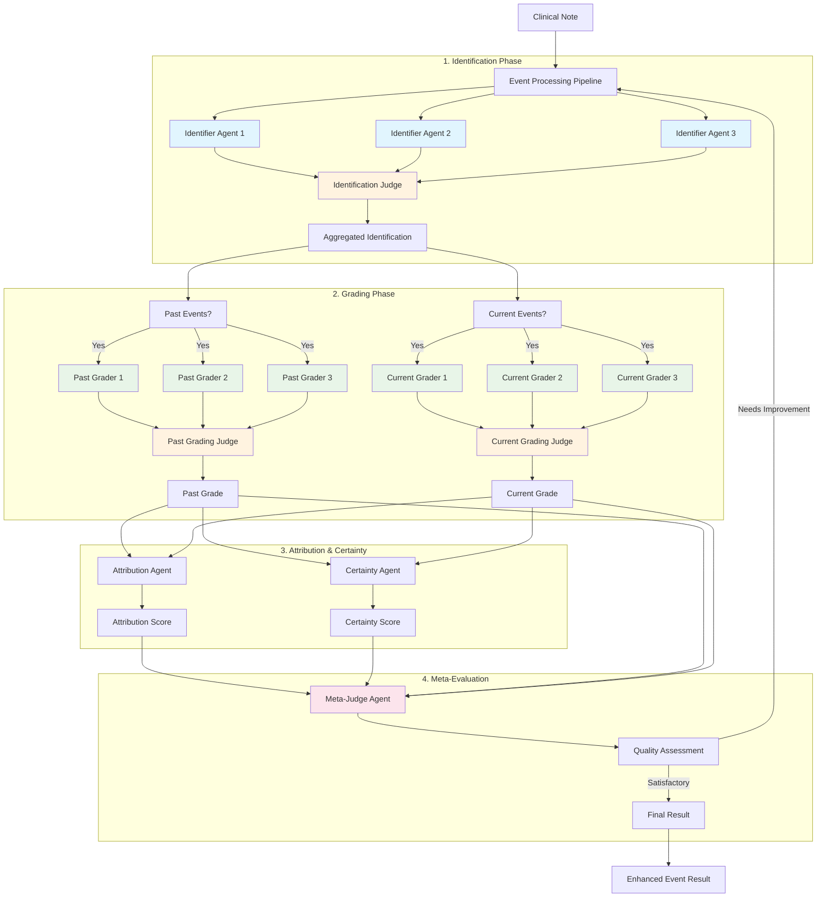
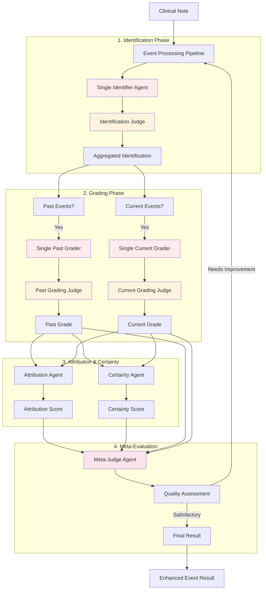
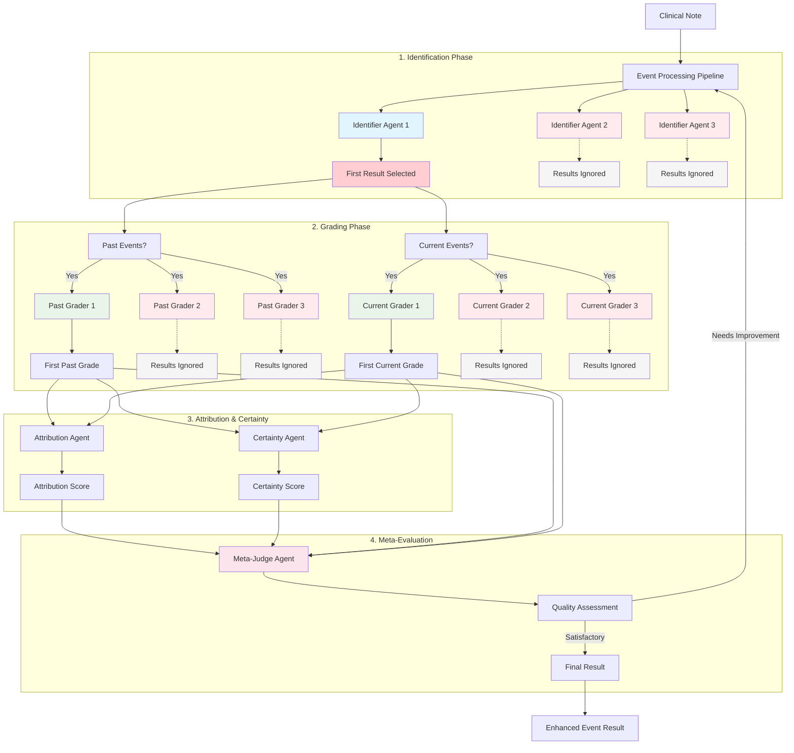
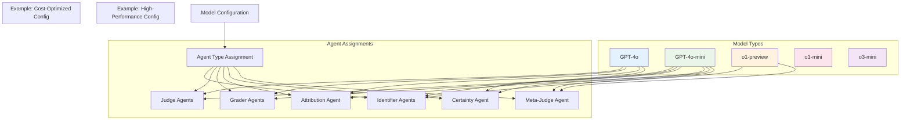
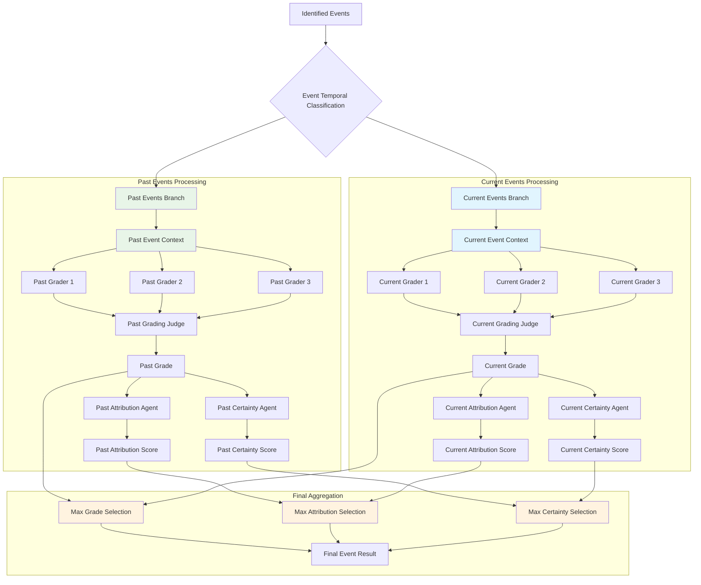
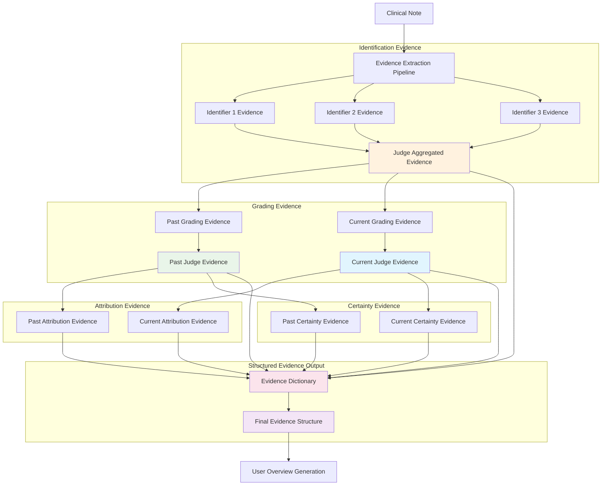
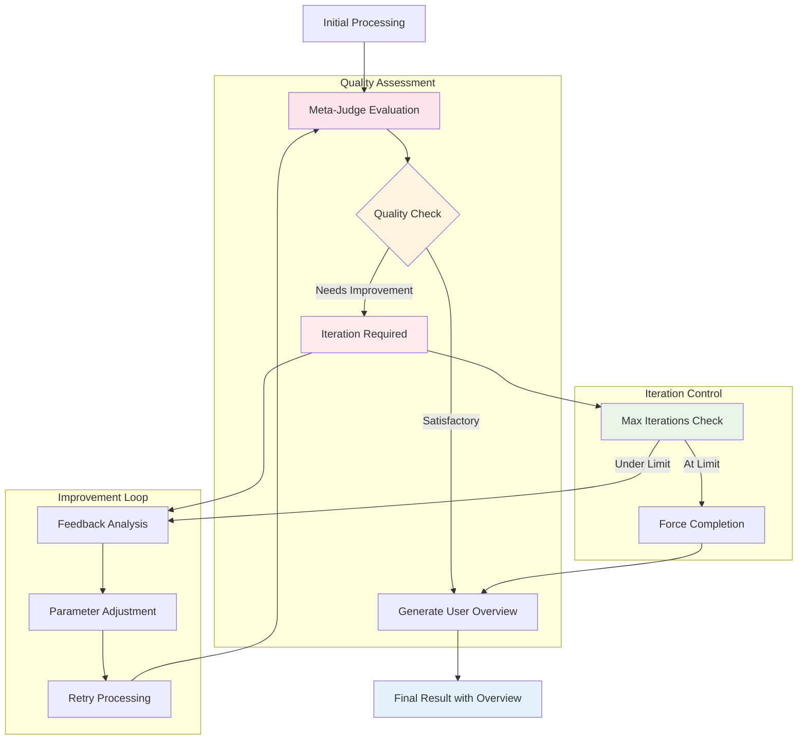
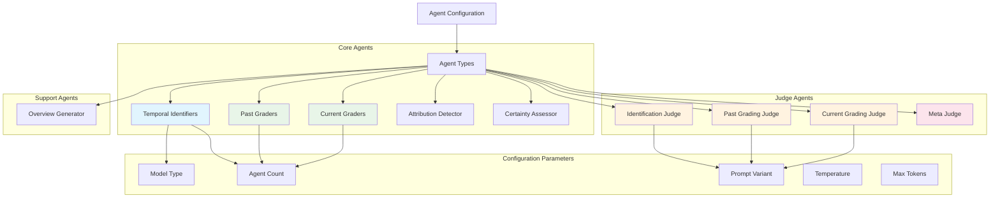

# IRAE Graph Architecture Variations

This document contains mermaid diagrams explaining the different architecture variations used in the IRAE Graph system for identifying and grading immune-related adverse events (IRAEs).

## 1. Standard Multi-Agent Architecture (Default)

The standard architecture uses multiple agents with judge-based consensus for both identification and grading phases.

## 2. Single Agent Architecture (ablation_single)

This variation uses only one agent for identification and grading, removing the self-consistency mechanism.

## 3. No-Judge Architecture (ablation_no_judge)

This variation removes judge agents and uses the first agent's result directly, eliminating consensus mechanisms.

## 4. Model Configuration Variations

Different models can be assigned to different agent types, allowing for specialized model selection.

## 5. Temporal Processing Architecture

The system processes past and current events separately, allowing for temporal-specific analysis.

## 6. Evidence Flow Architecture

Shows how evidence is collected and propagated through the system.

## 7. Iteration and Quality Control

Shows the meta-judge feedback loop for quality improvement.

## 8. Agent Configuration Matrix

Shows the different agent types and their configurable parameters.

## Architecture Comparison Summary

| Variant | Identifier Agents | Judge Usage | Self-Consistency | Use Case |
|---------|------------------|-------------|------------------|----------|
| **Default** | 3 agents | Full judges | High | Production quality |
| **ablation_single** | 1 agent | Full judges | None | Speed optimization |
| **ablation_no_judge** | 3 agents | No judges | Medium | Cost optimization |
| **Single + No Judge** | 1 agent | No judges | None | Minimal baseline |

## Key Benefits by Variant

### Multi-Agent with Judges (Default)
- **Highest accuracy** through consensus
- **Quality control** via judge evaluation
- **Robust evidence** collection
- **Best for production** use cases

### Single Agent
- **Faster processing** (fewer API calls)
- **Lower cost** (reduced token usage)
- **Simpler debugging** (single decision path)
- **Good for development** and testing

### No Judge
- **Reduced complexity** (no consensus needed)
- **Lower latency** (direct results)
- **Cost savings** (fewer judge calls)
- **Suitable for batch** processing

### Temporal Separation
- **Context-specific** analysis
- **Improved accuracy** for time-sensitive events
- **Separate evidence** tracking
- **Clinical relevance** preservation 